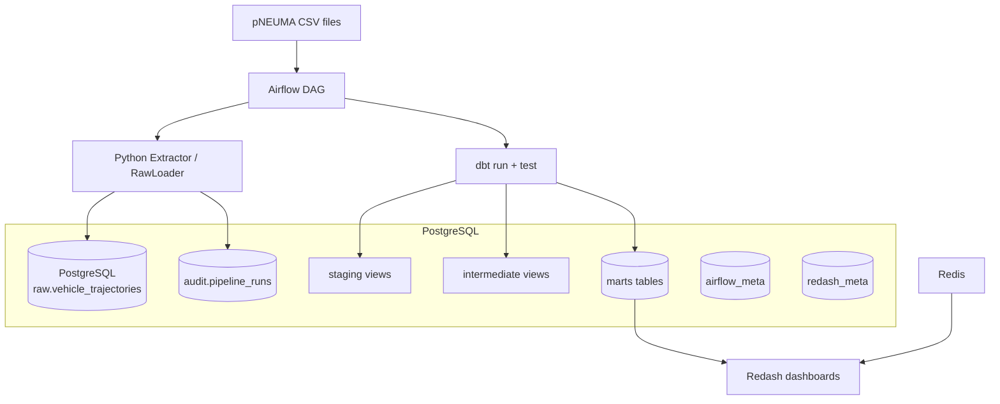

# Traffic Data ELT

A Data Engineering portfolio project demonstrating how an ELT platform evolves from a local prototype to a cloud-scale architecture while preserving reusable transformation logic.

The project ingests [pNEUMA](https://open-traffic.epfl.ch/index.php/about/) vehicle trajectory data collected from drone footage of Athens traffic, loads it into a PostgreSQL warehouse, transforms it with dbt, and serves analytical models through Redash dashboards.

## Overview

| | V1 — Local Prototype | V2 — Cloud Scale |
|---|---|---|
| Storage | PostgreSQL | AWS S3 + Cloud PostgreSQL |
| Processing | Python + dbt Core | Databricks / Spark + dbt |
| Orchestration | Apache Airflow | Apache Airflow |
| BI | Redash | Redash / equivalent |
| Status | **Implemented** | Planned |

V1 proves correctness, reproducibility, and clean architecture. V2 demonstrates the same logic at distributed scale.

## Architecture



**Data flow:** CSV → Airflow → Python ingestion → PostgreSQL raw → dbt staging → intermediate → marts → Redash

## Component Responsibilities

| Component | Role |
|-----------|------|
| **Airflow** | Orchestration, retries, dependency control. Runs ingestion then triggers dbt. |
| **Python ingestion** | pNEUMA CSV parsing, frame unpivoting, raw loading, idempotency via file hashing, audit writes. |
| **PostgreSQL** | Data warehouse (raw → marts), Airflow metadata, Redash metadata. Single server, three logical databases. |
| **dbt** | SQL transformation, testing, documentation, lineage. One shared project for V1 and V2. |
| **Redash** | BI/dashboard layer consuming marts tables. |
| **Docker Compose** | Local runtime orchestration of all services. |
| **Redis** | Celery broker for Redash task queue. Internal only. |

## Data Flow

1. Airflow discovers pNEUMA CSV files in the data directory.
2. Python extractor parses each file into frame-level trajectory records.
3. RawLoader writes records into `raw.vehicle_trajectories` within a transaction.
4. `audit.pipeline_runs` records the ingestion outcome (success/failed/skipped).
5. After all files load successfully, Airflow triggers `dbt run --select staging+`.
6. dbt builds: raw → staging → intermediate → marts.
7. `dbt test --select staging+` validates data quality.
8. `pipeline_success` task confirms the complete ELT cycle.
9. Redash queries marts for dashboard visualizations.

dbt does not ingest files — it transforms data already present in PostgreSQL.

## Warehouse Design

| Schema | Purpose | Materialization |
|--------|---------|-----------------|
| `raw` | Source data with minimal transformation. Loaded by Airflow/Python. | Tables (Airflow-managed) |
| `staging` | Cleaned, cast, renamed, standardized records. | Views |
| `intermediate` | Reusable trajectory-level aggregations. | Views |
| `marts` | Business-oriented fact and dimension models. | Tables |
| `analytics` | Reserved for dashboard-specific aggregations. | Not populated yet |
| `audit` | Pipeline metadata: load status, row counts, timestamps. | Tables (Airflow-managed) |

**Key models:**
- `staging.stg_vehicle_trajectories` — one row per frame observation
- `intermediate.int_vehicle_trajectory_summary` — one row per trajectory (source_file, track_id)
- `marts.fct_vehicle_trajectories` — fact table for trajectory analysis
- `marts.dim_vehicle_type` — dimension with per-type aggregate statistics

## Reliability and Failure Handling

The pipeline uses circuit-breaker semantics via standard Airflow dependency rules:

| Failure scenario | Behavior |
|-----------------|----------|
| Ingestion task fails | dbt tasks skipped, DAG fails |
| `dbt run` fails | `dbt test` skipped, DAG fails |
| `dbt test` fails | `pipeline_success` skipped, DAG fails |
| All succeed | `pipeline_success` runs, DAG succeeds |

Additional measures:
- **Retries:** 2 attempts with 60-second delay for transient failures
- **Failure callbacks:** Structured logging of dag_id, task_id, run_id, try_number, error
- **Audit persistence:** `audit.pipeline_runs` records every ingestion attempt
- **No exception suppression:** dbt exit codes are preserved; `all_success` trigger rules throughout
- **Idempotency:** File hash checks prevent duplicate loads on retry

## Data Quality

dbt tests enforce:
- `not_null` on all key columns across staging, intermediate, and marts
- Composite uniqueness on trajectory grain (source_file + track_id)
- `accepted_values` for vehicle_type
- `frame_count > 0` for every trajectory
- Non-negative duration, distance, and speed
- No invalid coordinates (latitude/longitude bounds)

Critical test failures cause the DAG to fail, preventing stale or incorrect data from reaching dashboards.

## Local Development

```text
Windows → WSL2 → Dev Container → Docker-in-Docker → V1 runtime containers
```

Docker-in-Docker is intentional — it isolates runtime containers from the host Docker daemon without socket mounting.

### Prerequisites

- Docker Desktop (or equivalent) with WSL2 backend
- VS Code / Kiro with Dev Containers extension

### Dev Container tools

- Python 3.12
- dbt-core + dbt-postgres
- Git, Docker, Docker Compose
- ggshield (GitGuardian CLI)
- pre-commit

## Running V1

```bash
# Start all services
cd v1_local
cp .env.example .env   # fill in credentials
docker compose up airflow-init       # one-time DB migration
docker compose up redash-create-db   # one-time Redash schema
docker compose up -d

# Trigger the pipeline
# Use Airflow UI at http://localhost:8080 or:
docker compose exec airflow-api-server airflow dags trigger ingest_pneuma_raw

# Run dbt manually (from Dev Container)
./scripts/dbt-v1.sh run --select staging+
./scripts/dbt-v1.sh test --select staging+

# Generate dbt docs
./scripts/dbt-v1.sh docs generate
./scripts/dbt-v1.sh docs serve --port 8000
```

## Services

| Service | URL | Purpose |
|---------|-----|---------|
| Airflow | http://localhost:8080 | DAG management and monitoring |
| Redash | http://localhost:5000 | Dashboards and SQL queries |
| PostgreSQL | localhost:5432 | Warehouse (direct access for development) |

Redis remains internal (no host port). Port availability depends on Dev Container forwarding configuration.

## Redash

Redash connects to the PostgreSQL warehouse and queries marts tables directly. It does not access raw data.

Example dashboard metrics:
- Total trajectory count
- Trajectories by vehicle type
- Average speed by vehicle type
- Average distance and duration

Dashboard SQL queries are version-controlled under `docs/redash/`.

## dbt Documentation

The dbt project includes:
- Model and column descriptions in YAML schema files
- Generic tests (not_null, unique, accepted_values)
- Singular tests for composite constraints and data quality
- Lineage graph showing raw → staging → intermediate → marts

Generate and browse locally:
```bash
./scripts/dbt-v1.sh docs generate
./scripts/dbt-v1.sh docs serve --port 8000
```

`dbt/traffic_dwh/target/` is generated output and excluded from Git.

## Repository Structure

```text
.devcontainer/          Dev Container configuration (Dockerfile, devcontainer.json)
dbt/traffic_dwh/        Shared dbt project (models, tests, macros, profiles)
docs/                   Architecture docs, decision records, Redash queries
scripts/                Helper scripts (dbt-v1.sh)
src/traffic_data_elt/   Shared Python package (extract, load, config, utils, callbacks)
tests/                  Unit and integration tests
v1_local/               V1 runtime: compose.yaml, Airflow DAGs/Dockerfile, Postgres init
v2_cloud/               V2 placeholder: cloud infrastructure (planned)
data/sample/            pNEUMA sample CSV files (gitignored except .gitkeep)
```

## V1 Design Decisions

| Decision | Rationale |
|----------|-----------|
| PostgreSQL as warehouse | Lightweight, sufficient for sample data, supports dbt-postgres |
| Airflow LocalExecutor | Single-node execution is adequate for V1 workloads |
| Staging/intermediate as views | Avoids data duplication; raw data is small enough |
| Marts as tables | Optimizes Redash query performance |
| Single PostgreSQL server | Reduces resource usage; logical databases provide separation |
| Docker Compose | Reproducible multi-service environment in one command |
| Docker-in-Docker | Keeps runtime containers isolated from host Docker |
| Read-only dbt mount in Airflow | Prevents Airflow from modifying dbt source; artifacts redirected to /tmp |
| Shared dbt project | Same models serve both V1 (Postgres) and V2 (cloud) targets |

## V2 Scaling Direction

V2 extends the same architecture to handle the full pNEUMA dataset (~500GB) using distributed processing:

```text
V1: local CSV → Airflow → PostgreSQL → dbt → Redash
V2: Zenodo   → Airflow → S3 → Databricks/Spark → Cloud PostgreSQL → dbt → Redash
```

Key differences:
- Source data streams to S3 rather than loading locally
- Spark handles large-scale frame unpivoting and initial processing
- Cloud PostgreSQL serves the transformed warehouse
- Same dbt project with a different target profile
- Airflow remains the orchestrator

V2 is not yet implemented.

## Security

- `.env` files are never committed (listed in `.gitignore`)
- Secrets are injected through environment variables at runtime
- GitGuardian / ggshield scans staged changes via pre-commit hook
- GitHub Actions workflow runs ggshield on push
- No credentials in Dockerfiles, Compose files, or DAGs
- Database ports are exposed only for local development convenience

## Python Setup

```bash
pip install -e ".[dev]"
```

Core dependencies: `pandas`, `psycopg[binary]`

Dev dependencies: `pytest`, `pytest-cov`, `ruff`

## License

This project is a portfolio demonstration. The pNEUMA dataset is provided by EPFL under their [open data terms](https://open-traffic.epfl.ch/).
