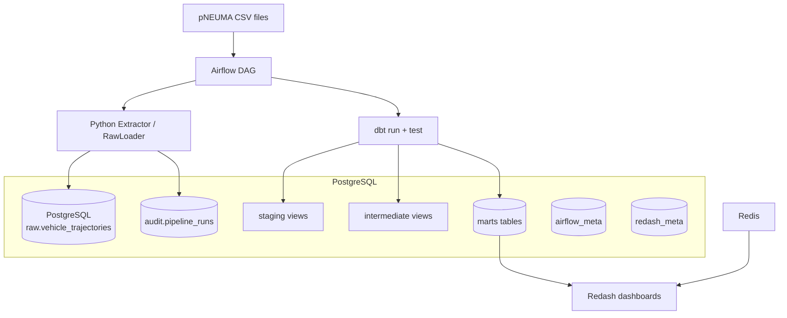
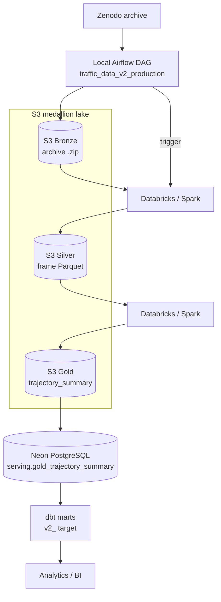

# Traffic Data ELT

A Data Engineering portfolio project demonstrating how an ELT platform evolves from a local prototype to a cloud-scale architecture while preserving reusable transformation logic.

The project ingests [pNEUMA](https://open-traffic.epfl.ch/index.php/about/) vehicle trajectory data collected from drone footage of Athens traffic and processes it through two implementations that share the same Python parsing logic and dbt project: **V1** loads a sample into a local PostgreSQL warehouse; **V2** streams the full archive to an S3 medallion lake, processes it with Databricks/Spark, and serves a compact dataset from Neon PostgreSQL. Both transform with dbt and can surface results in Redash.

## Overview

| | V1 — Local Prototype | V2 — Cloud Scale |
|---|---|---|
| Storage | PostgreSQL | AWS S3 (Bronze/Silver/Gold) + Neon PostgreSQL (serving) |
| Processing | Python + dbt Core | Databricks / Spark + dbt |
| Orchestration | Apache Airflow | Local Apache Airflow (triggers Databricks jobs) |
| BI | Redash | Redash / equivalent |
| Status | **Implemented** | **Implemented** |

V1 proves correctness, reproducibility, and clean architecture. V2 runs the same
parsing, data-quality, and semantic logic at distributed scale: it streams the
full ~15.76 GB pNEUMA archive to S3, processes it with Spark across the medallion
layers (Bronze → Silver → Gold), publishes a compact serving dataset into Neon
PostgreSQL, and reuses the single shared dbt project for the semantic marts.

## Architecture

### V1 — Local Prototype



**V1 data flow:** CSV → Airflow → Python ingestion → PostgreSQL raw → dbt staging → intermediate → marts → Redash

### V2 — Cloud Scale



**V2 data flow:** Zenodo → Airflow → S3 Bronze → Databricks/Spark → S3 Silver → Spark → S3 Gold → Neon → shared dbt marts → BI

## Component Responsibilities

Some components are shared across both versions; others are version-specific.

| Component | Used by | Role |
|-----------|---------|------|
| **Shared Python package** (`src/traffic_data_elt/`) | V1 + V2 | pNEUMA parsing, extraction/loading logic, config, Databricks runtime modules. Imported by both the V1 DAG and the V2 Databricks jobs — never duplicated. |
| **dbt** (`dbt/traffic_dwh/`) | V1 + V2 | SQL transformation, testing, documentation, lineage. One shared project; V1 targets local Postgres, V2 targets a `v2_<branch>` Neon target. |
| **Apache Airflow** | V1 + V2 | Orchestration, retries, dependency control. V1 runs ingestion then dbt; V2 orchestrates Bronze→Silver→Gold→Neon→dbt by triggering Databricks jobs. Both DAGs run on the **same** local Airflow stack. |
| **PostgreSQL (local)** | V1 | Data warehouse (raw → marts) plus Airflow and Redash metadata. Single server, three logical databases. |
| **Redash** | V1 (+ V2) | BI/dashboard layer consuming marts. |
| **Redis** | V1 | Celery broker for Redash task queue. Internal only. |
| **AWS S3** | V2 | Medallion data lake: Bronze (immutable source ZIP), Silver (normalised frame Parquet), Gold (trajectory-summary Parquet). |
| **Databricks / Spark** | V2 | Distributed archive decompression, parsing (shared parser), normalisation, aggregation. Serverless compute. |
| **Neon PostgreSQL** | V2 | Compact serving warehouse — holds only the Gold-derived serving dataset (no frame-level data). |
| **Docker Compose** | V1 + V2 | Local runtime. V2 adds an overlay (`v2_cloud/airflow/compose.v2.yaml`) on the V1 stack rather than a second Airflow. |

## Data Flow

### V1 (local)

1. Airflow discovers pNEUMA CSV files in the data directory.
2. The shared Python extractor parses each file into frame-level trajectory records.
3. `RawLoader` writes records into `raw.vehicle_trajectories` within a transaction.
4. `audit.pipeline_runs` records the ingestion outcome (success/failed/skipped).
5. After all files load successfully, Airflow triggers `dbt run --select staging+`.
6. dbt builds: raw → staging → intermediate → marts (speed normalised km/h → m/s at staging).
7. `dbt test --select staging+` validates data quality.
8. `pipeline_success` confirms the complete ELT cycle.
9. Redash queries marts for dashboards.

dbt does not ingest files — it transforms data already present in PostgreSQL.

### V2 (cloud scale)

The `traffic_data_v2_production` DAG (manual trigger) orchestrates:

1. **Preflight** — validate runtime layout, Databricks CLI auth, and the Neon production write gate.
2. **Bootstrap** — programmatically ensure the UC artifact/temp volumes, deploy the versioned wheel, and import the notebooks.
3. **Bronze** — stream the Zenodo archive to `s3://.../bronze/pneuma/<archive>.zip` (resumable ranged-multipart; no full local staging), then validate.
4. **Silver** — Databricks job downloads/unzips to a UC volume, runs the shared parser over **every** CSV, normalises (km/h → m/s), writes `silver/pneuma/trajectories/` Parquet, then validate.
5. **Gold** — Spark aggregates Silver to the trajectory grain → `gold/pneuma/trajectory_summary/`, then validate (incl. frame conservation vs Silver).
6. **Neon** — publish the compact Gold-derived serving dataset into `serving.gold_trajectory_summary`, then validate.
7. **dbt** — build the shared marts against the `v2_<branch>` target, then validate.
8. **Cleanup + success** — drop the temp UC volume (on full success) and mark `pipeline_success`.

Heavy frame-level data stays in S3; only the compact serving dataset reaches Neon.

## Warehouse & Storage Design

### V1 — PostgreSQL warehouse

| Schema | Purpose | Materialization |
|--------|---------|-----------------|
| `raw` | Source data with minimal transformation (speed kept as source km/h). Loaded by Airflow/Python. | Tables (Airflow-managed) |
| `staging` | Cleaned, cast, renamed, standardized records (speed normalised to m/s). | Views |
| `intermediate` | Reusable trajectory-level aggregations. | Views |
| `marts` | Business-oriented fact and dimension models. | Tables |
| `analytics` | Reserved for dashboard-specific aggregations. | Not populated yet |
| `audit` | Pipeline metadata: load status, row counts, timestamps. | Tables (Airflow-managed) |

### V2 — S3 medallion lake + Neon serving

| Layer | Location | Contents |
|-------|----------|----------|
| Bronze | `s3://<bucket>/bronze/pneuma/<archive>.zip` | Immutable compressed source archive |
| Silver | `s3://<bucket>/silver/pneuma/trajectories/` | Normalised frame-level Parquet (one row per frame, m/s) |
| Gold | `s3://<bucket>/gold/pneuma/trajectory_summary/` | Trajectory-level aggregate Parquet |
| Serving | Neon `serving.gold_trajectory_summary` | Compact 19-column serving dataset (one row per trajectory) |

Test data uses **sibling** prefixes (`silver/test/pneuma/...`, `gold/test/pneuma/...`), never nested under the production leaf, so a recursive Spark read of production can't mix in test data.

### Shared dbt models

The same models serve both versions (V1 reads local Postgres; V2 reads the Neon serving source via a target-aware ephemeral adapter):
- `staging.stg_vehicle_trajectories` — one row per frame observation (V1)
- `intermediate.int_vehicle_trajectory_summary` — one row per trajectory `(source_file, track_id)` (V1); V2 computes this grain in Spark (Gold)
- `marts.fct_vehicle_trajectories` — trajectory fact (table under V1, view under V2)
- `marts.dim_vehicle_type` — per-type aggregate dimension

## Reliability and Failure Handling

Both DAGs use circuit-breaker semantics via standard Airflow dependency rules — a failed stage skips everything downstream and fails the DAG. Each processing stage is followed by an explicit validation task, so bad data cannot silently propagate.

**V1:**

| Failure scenario | Behavior |
|-----------------|----------|
| Ingestion task fails | dbt tasks skipped, DAG fails |
| `dbt run` fails | `dbt test` skipped, DAG fails |
| `dbt test` fails | `pipeline_success` skipped, DAG fails |
| All succeed | `pipeline_success` runs, DAG succeeds |

**V2** (`traffic_data_v2_production`): each of Bronze / Silver / Gold / Neon / dbt is paired with a `validate_*` task; a failed validation stops the chain. Cleanup (`drop_v2_temp_volume`) runs only on `ALL_SUCCESS`, so a failed run leaves the temp volume for diagnosis.

Additional measures:
- **Fail-fast preflight (V2):** `preflight_config` validates the runtime layout (`REPO_ROOT`, `DBT_PROJECT_DIR`, notebook sources) and names the env var to fix before any heavy work runs.
- **Retries:** transient-failure retries with delay (e.g. Bronze ingest retries the failed part, not the whole ~15 GB transfer).
- **Idempotency:** V1 uses file-hash checks to prevent duplicate loads; V2 Bronze reuses an already-uploaded object (HEAD-before-upload) and the Neon publish is source-scoped/rerunnable.
- **Failure callbacks:** structured logging of dag_id, task_id, run_id, try_number, error.
- **Audit persistence (V1):** `audit.pipeline_runs` records every ingestion attempt.
- **Production write gate (V2):** publishing to a `production` Neon branch requires an explicit `ALLOW_PRODUCTION_WRITE=true`.
- **No exception suppression:** dbt/job exit codes are preserved; `all_success` trigger rules throughout.

## Data Quality

**dbt tests** (both versions) enforce:
- `not_null` on all key columns across staging, intermediate, and marts
- Composite uniqueness on trajectory grain (`source_file` + `track_id`)
- `accepted_values` for `vehicle_type`
- `frame_count > 0` for every trajectory
- Non-negative duration, distance, and speed
- No invalid coordinates (latitude/longitude bounds)

**V2 Spark/serving validation** (in-pipeline, before data advances):
- The parser validates the `4 + N×6` logical record structure, repairs known source splits, and rejects malformed records.
- `silver_validator` checks the Silver Parquet: schema/types, non-null, Athens coordinate bounds, speed ≥ 0.
- `gold_validator` checks Gold: schema/types, grain uniqueness, and **frame conservation** (`SUM(frame_count)` equals the Silver row count).
- The Neon load stages and validates rows before publishing.

Critical failures cause the DAG to fail, preventing stale or incorrect data from reaching dashboards or the serving warehouse.

## Local Development

```text
Windows → WSL2 → Dev Container → Docker-in-Docker → runtime containers
```

Docker-in-Docker is intentional — it isolates runtime containers from the host Docker daemon without socket mounting. Both V1 and V2 run on the same local Airflow stack; V2 adds a Compose overlay rather than a second Airflow platform.

### Prerequisites

- Docker Desktop (or equivalent) with WSL2 backend
- VS Code / Kiro IDE with Dev Containers extension

### Dev Container tools

- Python 3.12
- dbt-core + dbt-postgres
- Git, GitHub CLI, Docker, Docker Compose
- AWS CLI (V2 S3 / IAM work)
- Databricks CLI (V2 OAuth login, `databricks fs`, Asset Bundles)
- Neon CLI (V2 serving-warehouse project/branch management)
- ggshield (GitGuardian CLI)
- Ruff (linter) + pre-commit

The V2 cloud infrastructure is
provisioned via the AWS / Databricks / Neon CLIs and the sample IAM/S3 configs
under `v2_cloud/aws/`.

## Running V1

```bash
# Start all services
cd v1_local
cp .env.example .env   # fill in credentials
docker compose up airflow-init       # one-time DB migration
docker compose up redash-create-db   # one-time Redash schema
docker compose up -d

# Trigger the pipeline
# Use Airflow UI at http://localhost:8080 or:
docker compose exec airflow-api-server airflow dags trigger ingest_pneuma_raw

# Run dbt manually (from Dev Container)
./scripts/dbt-v1.sh run --select staging+
./scripts/dbt-v1.sh test --select staging+

# Generate dbt docs
./scripts/dbt-v1.sh docs generate
./scripts/dbt-v1.sh docs serve --port 8000
```

## Running V2

V2 runs on the **same** local Airflow stack as V1, extended by a Compose overlay
(`v2_cloud/airflow/compose.v2.yaml`) and an image layer — there is no second
Airflow platform. Complete the [Fresh Cloud Setup](#fresh-cloud-setup-v2-from-zero)
first (AWS/Databricks/Neon auth, UC external location, `v2_cloud/.env`).

```bash
# 1. Stage host credentials (Databricks + AWS) into a git-ignored dir the
#    containers can read (originals untouched).
bash v2_cloud/airflow/stage_credentials.sh

# 2. Build the V1 base image, then the V2 image on top.
cd v1_local
docker compose -f compose.yaml build airflow-api-server
docker compose -f compose.yaml -f ../v2_cloud/airflow/compose.v2.yaml build

# 3. Initialise Airflow metadata (once), then start the overlaid stack.
docker compose -f compose.yaml -f ../v2_cloud/airflow/compose.v2.yaml up airflow-init
docker compose -f compose.yaml -f ../v2_cloud/airflow/compose.v2.yaml up -d
```

Both `ingest_pneuma_raw` (V1) and `traffic_data_v2_production` (V2) appear in the
Airflow UI (http://localhost:8080). Trigger V2 manually once its preflight gates
are green:

```bash
docker compose -f compose.yaml -f ../v2_cloud/airflow/compose.v2.yaml \
  exec airflow-scheduler airflow dags trigger traffic_data_v2_production
```

The DAG bootstraps the Databricks runtime (UC volumes, versioned wheel, notebook
import) and orchestrates Bronze → Silver → Gold → Neon → dbt. The production
Neon write stays gated behind `NEON_BRANCH=production` **and**
`ALLOW_PRODUCTION_WRITE=true`.

Re-run `stage_credentials.sh` whenever you refresh `databricks auth login` or
rotate AWS credentials. The full runbook, credential-scope rationale, and
managed-orchestrator portability notes are in
[`v2_cloud/airflow/README.md`](v2_cloud/airflow/README.md).

## Services

Local services (V1 + the V2 Airflow overlay):

| Service | URL | Purpose |
|---------|-----|---------|
| Airflow | http://localhost:8080 | DAG management and monitoring (both `ingest_pneuma_raw` and `traffic_data_v2_production`) |
| Redash | http://localhost:5000 | Dashboards and SQL queries |
| PostgreSQL | localhost:5432 | V1 warehouse (direct access for development) |

Redis remains internal (no host port). Port availability depends on Dev Container forwarding configuration.

V2 also uses external, credentialed consoles rather than local ports: the AWS S3
console (data lake), the Databricks workspace (Spark jobs), and the Neon console
(serving warehouse).

## Redash

Redash connects to the PostgreSQL warehouse and queries marts tables directly. It does not access raw data.

Example dashboard metrics:
- Total trajectory count
- Trajectories by vehicle type
- Average speed by vehicle type
- Average distance and duration

Dashboard SQL queries are version-controlled under `docs/redash/`.

## dbt Documentation

The dbt project includes:
- Model and column descriptions in YAML schema files
- Generic tests (not_null, unique, accepted_values)
- Singular tests for composite constraints and data quality
- Lineage graph showing raw → staging → intermediate → marts

Generate and browse locally:
```bash
./scripts/dbt-v1.sh docs generate
./scripts/dbt-v1.sh docs serve --port 8000
```

`dbt/traffic_dwh/target/` is generated output and excluded from Git.

## Repository Structure

```text
.devcontainer/          Dev Container configuration (Dockerfile, devcontainer.json)
dbt/traffic_dwh/        Shared dbt project (models, tests, macros, profiles)
docs/                   Architecture docs, decision records, Redash queries
scripts/                Helper scripts (dbt-v1.sh)
src/traffic_data_elt/   Shared Python package (extract, load, config, utils, callbacks, databricks)
tests/                  Unit and integration tests
v1_local/               V1 runtime: compose.yaml, Airflow DAGs/Dockerfile, Postgres init
v2_cloud/               V2 cloud: Airflow DAG, Databricks notebooks/jobs/schemas, sample AWS IAM/S3 configs
data/sample/            pNEUMA sample CSV files (gitignored except .gitkeep)
```

## V1 Design Decisions

| Decision | Rationale |
|----------|-----------|
| PostgreSQL as warehouse | Lightweight, sufficient for sample data, supports dbt-postgres |
| Airflow LocalExecutor | Single-node execution is adequate for V1 workloads |
| Staging/intermediate as views | Avoids data duplication; raw data is small enough |
| Marts as tables | Optimizes Redash query performance |
| Single PostgreSQL server | Reduces resource usage; logical databases provide separation |
| Docker Compose | Reproducible multi-service environment in one command |
| Docker-in-Docker | Keeps runtime containers isolated from host Docker |
| Read-only dbt mount in Airflow | Prevents Airflow from modifying dbt source; artifacts redirected to /tmp |
| Shared dbt project | Same models serve both V1 (Postgres) and V2 (cloud) targets |

## V2 — Cloud Scale Details

V2 runs the same logic at distributed scale on the full pNEUMA archive
(~15.76 GB compressed). It is implemented under `v2_cloud/` and the shared
`src/traffic_data_elt/databricks/` package. See the
[V2 data flow](#v2-cloud-scale) above for the stage-by-stage pipeline.

Key properties:
- The shared Python parser and shared dbt project are reused, not duplicated.
- Speed is stored faithfully: the source/raw layer keeps km/h (`*_kmh`) and the
  conversion to true m/s (`*_ms`, ÷ 3.6) happens once at the V1 dbt staging
  boundary and once at the V2 Silver boundary; acceleration stays m/s².
- Every CSV member of the archive reaches Silver (one `source_file` per
  drone/session), so no source file is silently dropped.
- Test and production S3 data are **sibling** prefixes
  (`silver/test/pneuma/...` vs `silver/pneuma/...`), so a recursive Spark read
  of production can never mix in test data.

See [`v2_cloud/databricks/README.md`](v2_cloud/databricks/README.md) for the
Databricks runtime, wheel/bootstrap model, UC volume lifecycle, and job
parameters, and [`v2_cloud/airflow/README.md`](v2_cloud/airflow/README.md) for
the DAG runbook and portability notes.

## Fresh Cloud Setup (V2, from zero)

A brand-new machine + brand-new cloud accounts can be brought up in this order.
All secrets live in the untracked `v2_cloud/.env` (only `.env.example` is
committed).

1. **Dev dependencies** — inside the Dev Container:
   ```bash
   pip install -e ".[dev]"
   pre-commit install
   ```
2. **GitGuardian auth** — set `GITGUARDIAN_API_KEY` (or `ggshield auth login`)
   so the pre-commit secret scan works.
3. **AWS CLI** — `aws configure` (or an attached role). boto3/`dbutils` use the
   standard provider chain; no keys are stored in the repo.
4. **AWS IAM role + Databricks trust policy** — create the S3 access role and
   the storage-credential trust policy. Use the samples under
   `v2_cloud/aws/iam/sample-iam-config.yaml` and
   `v2_cloud/aws/s3/sample-s3-role-config.yaml` as templates.
5. **Databricks CLI** — `databricks auth login --host <workspace-url>` (OAuth;
   writes `~/.databrickscfg`). No token in `.env`.
6. **Unity Catalog storage credential + S3 external location** — create the UC
   storage credential (backed by the IAM role from step 4) and an external
   location for the S3 bucket. Databricks reads S3 through this external
   location (no boto3 keys on serverless). This is a required, one-time,
   account-level step — the notebooks assume it exists.
7. **Neon CLI / project / branch** — set `NEON_API_KEY` in `v2_cloud/.env`,
   then create the project/branch and capture the connection parameters
   (`neon connection-string <branch>`). See `.devcontainer/SETUP.md` for the
   headless-container auth note.
8. **Databricks Neon secret** — store the Neon password in a Databricks secret
   scope (never a job parameter):
   ```bash
   python scripts/bootstrap_databricks_neon_secret.py \
       --databricks-profile DEFAULT --env-file v2_cloud/.env \
       --scope v2-neon --key db-password
   ```
9. **Environment files** — copy `v2_cloud/.env.example` to `v2_cloud/.env` and
   fill in `AWS_REGION`, `S3_BUCKET`, `ZENODO_URL`, and the `NEON_DB_*` values.
10. **Docker / Airflow startup** — bring up the local runtime (V1 compose plus
    the V2 Airflow overlay under `v2_cloud/airflow/`).
11. **V2 bootstrap + run** — the production DAG bootstrap step programmatically
    creates the UC volumes (`v2_temp`, `v2_artifacts`), deploys the versioned
    wheel, and imports the notebooks; then it orchestrates Bronze → Silver →
    Gold → Neon → dbt. Trigger it from the Airflow UI.

## Security

- `.env` files are never committed (listed in `.gitignore`)
- Secrets are injected through environment variables at runtime; the Neon
  password is stored in a Databricks secret scope, never in `.env` or job params
- GitGuardian / ggshield scans staged changes via pre-commit hook
- GitHub Actions runs ggshield on push (`.github/workflows/security.yml`) and a
  Ruff-lint + full pytest quality gate (`.github/workflows/ci.yml`)
- No credentials in Dockerfiles, Compose files, DAGs, or dbt profiles
- Database ports are exposed only for local development convenience

## Python Setup

```bash
pip install -e ".[dev]"
pre-commit install   # enables ggshield + ruff on commit
```

Core dependencies: `pandas`, `psycopg[binary]`, `boto3`, `requests`

Dev dependencies: `pytest`, `pytest-cov`, `ruff`, `python-dotenv`

Quality gates:
```bash
ruff check .    # lint (config in pyproject.toml [tool.ruff.lint])
pytest -q       # full suite; integration tests self-skip without live creds
```

## License

This project is a portfolio demonstration. The pNEUMA dataset is provided by EPFL under their [open data terms](https://open-traffic.epfl.ch/).
