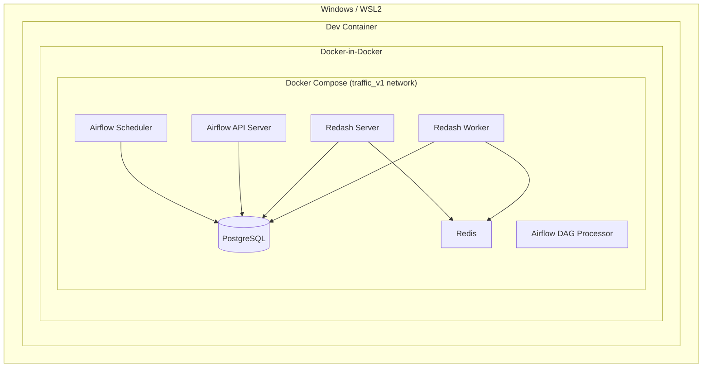
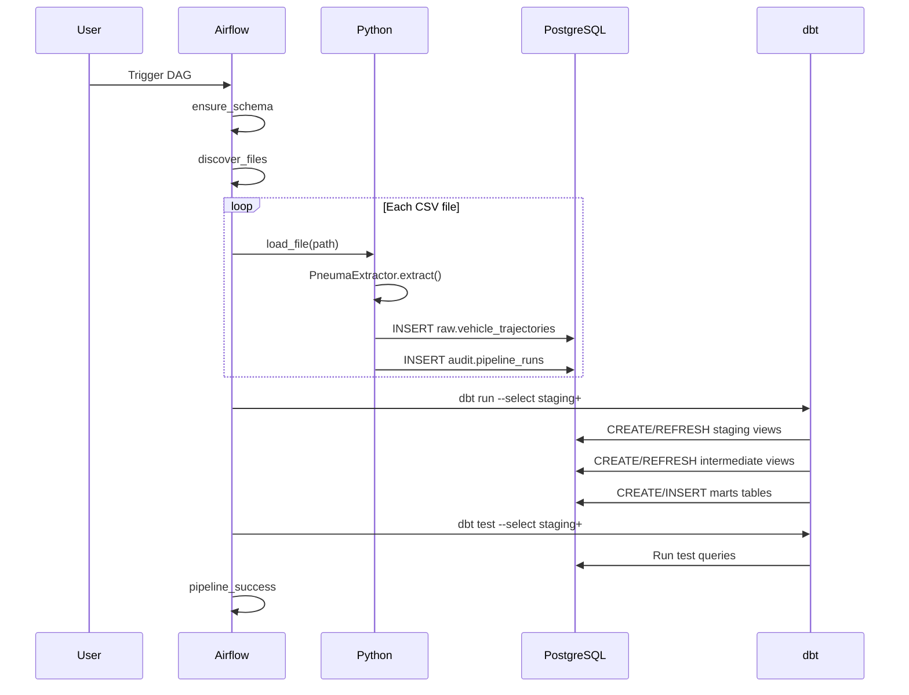
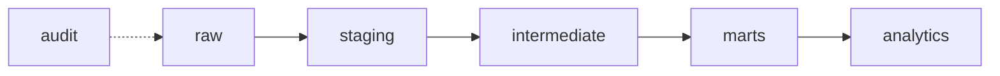

# V1 Local Prototype — Architecture

## System Context

The V1 prototype runs entirely within Docker containers orchestrated by Docker Compose, inside a Docker-in-Docker development environment.



All services communicate over the `traffic_v1` Docker network using service hostnames. PostgreSQL is addressed as `postgres` from within the Compose network.

## Runtime Services

| Service | Image | Purpose | Exposed Port |
|---------|-------|---------|--------------|
| postgres | postgres:16-alpine | Warehouse + metadata databases | 5432 |
| airflow-api-server | traffic-airflow:3.0.3 | Airflow UI and API | 8080 |
| airflow-scheduler | traffic-airflow:3.0.3 | Task execution (LocalExecutor) | — |
| airflow-dag-processor | traffic-airflow:3.0.3 | DAG file parsing | — |
| redash-server | redash/redash:10.1.0 | Dashboard UI | 5000 |
| redash-worker | redash/redash:10.1.0 | Query execution (Celery) | — |
| redis | redis:7.2-alpine | Redash task broker | — (internal) |

## PostgreSQL Databases

One PostgreSQL server hosts three logical databases:

| Database | Owner | Purpose |
|----------|-------|---------|
| `traffic_dwh` | `traffic_user` | Data warehouse (raw, staging, intermediate, marts, analytics, audit) |
| `airflow_meta` | `airflow_user` | Airflow metadata |
| `redash_meta` | `redash_user` | Redash metadata |

## Execution Flow



## DAG Dependency Graph

```text
ensure_schema
    ↓
discover_files
    ↓
load_file.expand(...)   [one task per CSV]
    ↓
dbt_run                 [dbt run --select staging+]
    ↓
dbt_test                [dbt test --select staging+]
    ↓
pipeline_success
```

All dependencies use `all_success` trigger rules. Any upstream failure causes downstream tasks to be skipped and the DAG to fail.

## Warehouse Layers



| Layer | Materialization | Content |
|-------|-----------------|---------|
| raw | Tables (Airflow-managed) | Frame-level trajectory records as ingested |
| staging | Views | Cleaned, cast, renamed records |
| intermediate | Views | Trajectory-level aggregations (one row per track) |
| marts | Tables | Fact and dimension models for reporting |
| analytics | Tables (reserved) | Dashboard-specific aggregations (not yet populated) |
| audit | Tables (Airflow-managed) | Pipeline run metadata |

## Airflow Container Configuration

The custom Airflow image (`traffic-airflow:3.0.3`) extends `apache/airflow:3.0.3` with:
- The shared `traffic_data_elt` Python package
- `dbt-core` and `dbt-postgres`

Bind mounts into Airflow containers:
- `v1_local/airflow/dags/` → `/opt/airflow/dags` (read-only)
- `src/traffic_data_elt/` → `/opt/traffic_data_elt_src/traffic_data_elt` (read-only)
- `dbt/traffic_dwh/` → `/opt/airflow/dbt/traffic_dwh` (read-only)
- `data/sample/` → `/data/sample` (read-only)

dbt writes logs and target artifacts to `/tmp` inside the container since the project mount is read-only.

## dbt Profile Resolution

Inside Airflow containers:
- `DBT_PROFILES_DIR=/opt/airflow/dbt/traffic_dwh`
- `TRAFFIC_DB_HOST=postgres` (Docker network hostname)
- Credentials from `v1_local/.env` via Compose `env_file`

From the Dev Container (manual execution):
- `DBT_PROFILES_DIR` set by `scripts/dbt-v1.sh`
- `TRAFFIC_DB_HOST=localhost` (port-forwarded from Compose)
- Credentials from `dbt/traffic_dwh/.env`

The same `profiles.yml` serves both contexts using `env_var()` with defaults.

## Failure Handling

| Component | Strategy |
|-----------|----------|
| Airflow tasks | 2 retries, 60s delay, on_failure_callback logs structured context |
| Ingestion | File hash idempotency prevents duplicate loads on retry |
| dbt run | Non-zero exit code fails the Airflow task |
| dbt test | Non-zero exit code fails the Airflow task |
| Circuit breaker | Standard `all_success` dependencies; no exception suppression |

## V1 vs V2 Comparison

| Aspect | V1 | V2 (planned) |
|--------|----|----|
| Source | Local pNEUMA sample CSV | Full dataset from Zenodo |
| Storage | PostgreSQL | S3 + Cloud PostgreSQL |
| Processing | Python + dbt | Spark/Databricks + dbt |
| Scale | ~1 file, ~1M frames | ~500GB, billions of frames |
| Orchestrator | Airflow (LocalExecutor) | Airflow (CeleryExecutor or managed) |
| dbt project | `dbt/traffic_dwh` | Same project, different target |
| Infrastructure | Docker Compose | Terraform / cloud-native |

The shared dbt project and Python package are designed to work in both environments with configuration-only changes.
